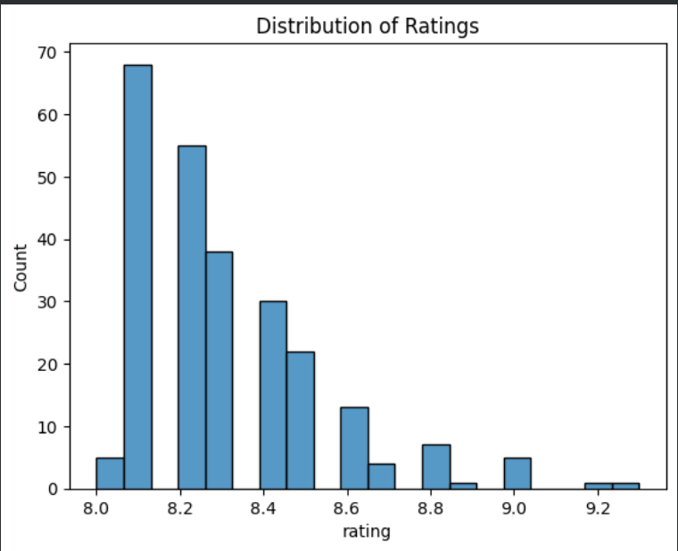
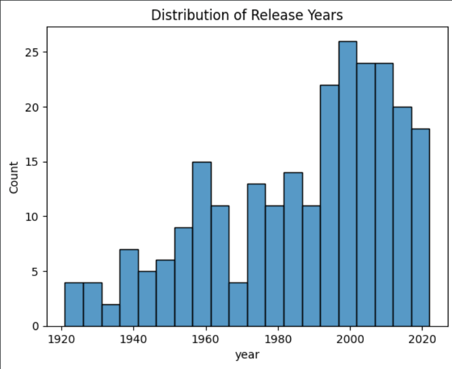
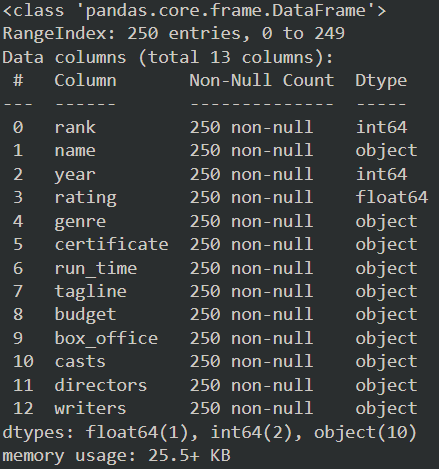

# Laporan Proyek Machine Learning - Aulia Afifah

## Project Overview

Di era digital, data menjadi kunci untuk memahami berbagai aspek kehidupan, salah satunya adalah industri film. IMDB (_Internet Movie Database_) sebagai sumber utama informasi tentang film, menyediakan data peringkat, ulasan, dan informasi lainnya dari pengguna di seluruh dunia. Dataset "IMDB Top 250 Movies" berisi 250 film teratas hingga tahun 2021, memberikan gambaran tentang film-film paling populer dan faktor-faktor yang memengaruhi kesuksesan sebuah film.

Dalam dunia perfilman, film bukan hanya merupakan karya seni yang memikat, tetapi juga menjadi sarana yang penting dalam membentuk karakter dan memberikan pembelajaran melalui nilai-nilai yang terkandung di dalamnya [1]. Namun, dengan perkembangan industri perfilman yang pesat, para penonton sering kali mengalami kesulitan dalam menemukan film yang sesuai dengan preferensi genre mereka [2]. Penelitian menunjukkan bahwa minat terhadap film semakin meningkat seiring berjalannya waktu, dan masyarakat semakin tertarik untuk menonton film berkualitas [3]. Oleh karena itu, pengembangan sistem rekomendasi film yang dapat menampilkan film-film dengan genre yang disukai pengguna menjadi semakin penting untuk memberikan pengalaman menonton yang lebih memuaskan.

Referensi:

[1] Apriliany, L., & Hermiati, H. (2021, May). Peran Media Film Dalam Pembelajaran Sebagai Pembentuk Pendidikan Karakter. In Prosiding Seminar Nasional Program Pascasarjana Universitas Pgri Palembang.

[2] Wardah, M. I., & Putra, S. D. (2022). Implementasi Machine Learning Untuk Rekomendasi Film Di Imdb Menggunakan Collaborative Filtering Berdasarkan Analisa Sentimen IMDB. Jurnal Manajamen Informatika Jayakarta, 2(3), 243-249.

[3] Ciaputra, A. T., & Hansun, S. (2020). Rekomendasi Pemilihan Film Dengan Hybrid Filtering Dan Knearest Neighbor. Jurnal Rekayasa Informasi, 9(2), 101-109.

## Business Understanding

Penelitian ini bertujuan untuk mengembangkan sistem rekomendasi film yang dapat memberikan rekomendasi film dengan genre yang sesuai dengan preferensi pengguna. Sistem ini diharapkan dapat memberikan manfaat signifikan bagi pengguna yang mencari hiburan dalam bentuk film yang sesuai dengan genre yang mereka minati.

1. Manfaat bagi bisnis dan ekonomi:

   - Peningkatan Retensi Pengguna: Dengan memberikan rekomendasi film yang lebih relevan dan sesuai dengan minat pengguna, platform film dapat meningkatkan retensi pengguna. Pengguna yang merasa puas dengan rekomendasi film yang diberikan cenderung untuk tetap menggunakan platform tersebut secara berkelanjutan.
   - Optimasi Pengalaman Pengguna: Pemberian rekomendasi film yang personal dan sesuai dengan preferensi pengguna akan mengoptimalkan pengalaman pengguna. Pengguna akan merasa bahwa platform dapat memahami preferensi mereka dan memberikan konten yang relevan, sehingga meningkatkan kepuasan pengguna.
   - Peningkatan Kepuasan Pengguna: Dengan memberikan rekomendasi yang tepat, pengguna akan lebih puas dengan pengalaman menonton mereka. Hal ini akan membantu platform dalam membangun citra merek yang positif dan meningkatkan reputasi mereka di industri.

2. Stakeholder dan sasaran

   - Platform film: Mereka adalah sasaran untuk meningkatkan retensi pengguna, meningkatkan pengalaman pengguna, dan meningkatkan kepuasan pengguna secara keseluruhan.
   - Pengguna: Pengguna adalah target utama dari rekomendasi film yang disediakan oleh platform. Mereka mencari pengalaman menonton yang memuaskan dan ingin menemukan konten yang sesuai dengan minat genre mereka dengan mudah.

### Problem Statements

1. Bagaimana cara mengatasi tantangan dalam pemilihan film yang sesuai dengan preferensi pengguna di tengah banyaknya pilihan yang tersedia? Banyaknya pilihan film yang tersedia dapat membuat pengguna kesulitan dalam memilih film yang sesuai dengan preferensi dan minat mereka.
2. Bagaimana cara meningkatkan pengalaman pengguna dengan menyediakan rekomendasi film yang sesuai dengan minat dan preferensi mereka? Platform film perlu meningkatkan pengalaman pengguna dengan menyediakan rekomendasi yang sesuai dengan minat dan preferensi pengguna.

### Goals

1. Membangun sistem rekomendasi yang efektif dan efisien untuk membantu pengguna memilih film yang sesuai dengan preferensi mereka di tengah banyaknya pilihan yang tersedia. Sistem ini akan menggunakan algoritma _content-based filtering_ untuk memberikan rekomendasi yang relevan berdasarkan genre yang disukai pengguna.
2. Mengembangkan model rekomendasi yang dapat meningkatkan pengalaman pengguna dengan menyediakan film-film yang sesuai dengan minat dan preferensi mereka. Dengan memanfaatkan algoritma _content-based filtering_, akan mampu menawarkan rekomendasi yang lebih personal dan relevan, sehingga pengguna merasa puas dan terus menggunakan layanan tersebut.

   ### Solution statements

   - Untuk mencapai tujuan di atas, akan menggunakan algoritma _content-based filtering_. Algoritma ini akan memberikan rekomendasi film berdasarkan kesamaan atribut film, seperti genre. Dengan memanfaatkan informasi-informasi tersebut, dapat menentukan film-film yang memiliki kesamaan karakteristik dengan film yang disukai oleh pengguna.

## Data Understanding

Dataset yang digunakan dalam proyek ini adalah "IMDB Top 250 Movies Dataset: The Most Highly Rated Movies on IMDB". Dataset ini dapat diunduh dari sumber Kaggle: [IMDB Top 250 Movies Dataset](https://www.kaggle.com/datasets/rajugc/imdb-top-250-movies-dataset). Dataset ini merupakan kumpulan data yang berisi informasi tentang 250 film teratas di IMDB pada tahun 2021. Data ini mencakup berbagai atribut film seperti judul, tahun rilis, rating, genre, sutradara, dan penulis. Jumlah Data: 250 baris.

Variabel dalam Dataset:

- rank: Nomor peringkat film dalam daftar top 250 IMDB.
- name: Nama film.
- year: Tahun rilis film.
- rating: Rating film oleh IMDB.
- genre: Genre film.
- certificate: Sertifikat film.
- run_time: Durasi total film.
- tagline: Tagline film.
- budget: Anggaran film.
- box_office: Pendapatan total di box office di seluruh dunia.
- casts: Nama-nama pemeran dalam film.
- directors: Nama-nama sutradara film.
- writers: Nama-nama penulis skenario film.

Visualisasi Tambahan:
Berikut adalah beberapa plot visualisasi tambahan untuk memberikan pemahaman yang lebih baik tentang dataset:

1. Histogram rating Film:

   - Distribusi rating film menunjukkan bahwa mayoritas film dalam daftar top 250 memiliki rating antara 8.0 hingga 9.3 yang dapat dilihat di gambar 1 bawah ini.
   - Puncak distribusi terlihat pada sekitar rating 8.1 hingga 8.4, menunjukkan bahwa banyak film yang mendapatkan rating tinggi namun tidak mencapai nilai sempurna.

   

2. Histogram Tahun Rilis:

   - Distribusi tahun rilis menunjukkan bahwa film-film yang masuk dalam daftar top 250 tersebar dari tahun 1920 hingga tahun 2021 yang dapat dilihat di gambar 2 bawah ini.
   - Ada peningkatan jumlah film dalam beberapa dekade terakhir, yang mungkin menunjukkan peningkatan produksi film berkualitas atau peningkatan jumlah film yang diakui oleh IMDB dalam beberapa tahun terakhir.

   

3. Jumlah data dan jenis genre: Representasi data genre menunjukkan bahwa terdapat 104 kombinasi genre unik dalam dataset. Keberagaman genre ini menunjukkan bahwa film-film top di IMDB datang dari berbagai macam kategori, yang mencerminkan preferensi yang luas di kalangan penonton. Genre paling umum seperti Drama, Action, dan Crime sering kali ditemukan, yang menunjukkan popularitas genre tersebut.

Insight-insight tersebut penting untuk memahami preferensi penonton dan tren dalam industri film. Serta memberikan dasar yang kuat untuk pengembangan model sistem rekomendasi film berbasis genre, di mana film yang mirip dengan genre yang disukai pengguna dapat direkomendasikan dengan lebih akurat.

## Data Preparation

Pada tahap ini, data akan dipersiapkan untuk pengembangan model. Berikut adalah langkah-langkah yang dilakukan:

1. Melihat Informasi pada Dataset: Dengan menggunakan df.info(), mendapatkan informasi tentang jumlah entri dan tipe data untuk setiap kolom.

   

   Pada gambar 3. Menunjukkan informasi mengenai kolum, isi data, dan tipe data.

- Int: Tipe data integer (int) adalah tipe data numerik yang digunakan untuk menyimpan bilangan bulat.
- Object: Tipe data object adalah tipe data umum yang digunakan untuk menyimpan teks atau string.
- Float: Tipe data float adalah tipe data numerik yang digunakan untuk menyimpan bilangan pecahan atau desimal.

2. Melihat Statistik Deskriptif: Dengan menggunakan df.describe(include="all"), mendapatkan statistik deskriptif untuk setiap variabel dalam dataset, baik numerik maupun kategorikal. Contoh sebagai berikut:
   - Jumlah Data: Terdapat 250 entri dalam dataset untuk setiap kolom.
   - Kolom _Unique_: Kolom menunjukkan jumlah nilai unik dalam setiap kolom. Misalnya, ada 104 genre unik, 13 _certificate_ unik, 127 _budget_ unik, dan sebagainya.
   - _Top_: Menunjukkan nilai paling sering muncul dalam setiap kolom. Contohnya, film yang paling sering muncul dalam dataset adalah "_The Shawshank Redemption_" dengan 19 kemunculan.
3. Penanganan Nilai yang Hilang: Dari informasi data, terlihat bahwa tidak ada nilai yang hilang dalam dataset. Oleh karena itu, tidak diperlukan penanganan khusus untuk nilai yang hilang.

Informasi Tambahan:

- Jumlah Data: 250 entri
- Tidak ada nilai yang hilang dalam dataset: Hal ini menunjukkan bahwa dataset lengkap dan siap untuk proses lebih lanjut tanpa memerlukan teknik imputasi atau penanganan missing value.

## Modeling

Pada tahap Modeling, menggunakan algoritma _content-based filtering_ untuk membuat rekomendasi film berdasarkan kemiripan genre antara film yang ada dalam dataset. Berikut adalah langkah-langkah yang dilakukan:

1. Inisialisasi _TfidfVectorizer_: Digunakan untuk mengubah teks genre menjadi vektor representasi numerik menggunakan pendekatan TF-IDF.
2. Melakukan Perhitungan IDF pada Data Genre: Menghitung nilai IDF (_Inverse Document Frequency_) untuk setiap kata kunci dalam teks genre.
3. Transformasi Data ke dalam Bentuk Matrix TF-IDF: Melakukan transformasi teks genre menjadi matriks TF-IDF yang dapat digunakan dalam perhitungan kemiripan.
4. Menghitung _Cosine Similarity_: Menghitung nilai _cosine similarity_ antara setiap pasang film berdasarkan matriks TF-IDF yang telah dihasilkan.
5. Membuat _DataFrame Similarity_: DataFrame _cosine_sim_df_ dibuat dengan baris dan kolom berupa nama film, di mana nilai di setiap sel adalah nilai kemiripan antara dua film.
6. Membuat Fungsi Rekomendasi Film: Dibuat fungsi film_recommendations untuk memberikan rekomendasi film berdasarkan kemiripan genre dengan film yang disediakan.
7. Menampilkan Rekomendasi: Menggunakan fungsi film_recommendations untuk mendapatkan rekomendasi film yang mirip dengan film "The Dark Knight".

Dengan menggunakan _content-based filtering_, dapat memberikan rekomendasi film yang memiliki kemiripan genre dengan film yang disukai pengguna. Rekomendasi tersebut bisa membantu pengguna menemukan film baru yang sesuai dengan preferensi mereka.
Dengan menggunakan fungsi film_recommendations (film_recommendations('The Dark Knight')
), bisa mendapatkan top-5 rekomendasi film yang mirip dengan film yang dipilih berdasarkan genre. Misalnya, jika ingin mencari film yang mirip dengan "The Dark Knight", akan mendapatkan hasil yang tertera di tabel 1 bawah ini:

|     | Name                                | Genre               |
| --- | ----------------------------------- | ------------------- |
| 0   | Léon: The Professional              | Action,Crime,Drama  |
| 1   | Heat                                | Action,Crime,Drama  |
| 2   | Batman Begins                       | Action,Crime,Drama  |
| 3   | Kill Bill: Vol. 1                   | Action,Crime,Drama  |
| 4   | Lock, Stock and Two Smoking Barrels | Action,Comedy,Crime |

1. Kelebihan _Content-Based Filtering_:
   - Tidak memerlukan informasi eksternal atau data pengguna lainnya, hanya memerlukan data internal tentang film itu sendiri.
   - Dapat memberikan rekomendasi yang personal dan sesuai dengan preferensi pengguna, karena didasarkan pada fitur-fitur yang dianggap penting oleh pengguna.
2. Kekurangan _Content-Based Filtering_:
   - Rentan terhadap over-specialization, di mana pengguna hanya menerima rekomendasi yang sangat mirip dengan film yang mereka sukai sebelumnya.
   - Tidak mampu memberikan rekomendasi untuk film-film yang berbeda dari preferensi pengguna atau untuk menemukan film-film baru yang mungkin tidak sesuai dengan preferensi mereka sebelumnya.

## Evaluation

Dalam proyek ini, metrik evaluasi yang digunakan adalah _precision_. Precision dihitung sebagai jumlah film yang direkomendasikan yang memiliki genre yang sama dengan genre film yang diketahui sebagai benar (_actual genre_) dibagi dengan total jumlah film yang direkomendasikan.

Hasil evaluasi menunjukkan bahwa _precision_ yang diperoleh adalah 0.80. Artinya, dari 5 film yang direkomendasikan, 4 film memiliki genre yang sesuai dengan genre film "_The Dark Knight_", yaitu _Action, Crime_, dan Drama.

Pada tabel 1. Menunjukkan bahwa 4 film memiliki genre yang sama dengan film "_The Dark Knight_", yaitu _Action, Crime_, dan Drama dan film '_Lock, Stock and Two Smoking Barrels_' memiliki Action, Comedy, Crime. Berbeda satu genre dengan film '_The Dark Knight_' yaitu drama.

Dengan _precision_ sebesar 0.80, dapat disimpulkan bahwa sistem rekomendasi yang dibangun memiliki tingkat akurasi yang cukup tinggi dalam merekomendasikan film-film yang sesuai dengan genre film yang diketahui. Hasil ini menunjukkan bahwa sistem rekomendasi telah berhasil memberikan rekomendasi yang relevan dengan preferensi pengguna berdasarkan genre film yang disukai sebelumnya.

**---Ini adalah bagian akhir laporan---**
